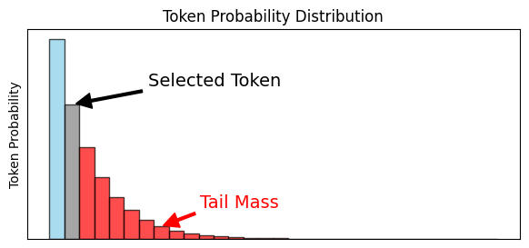
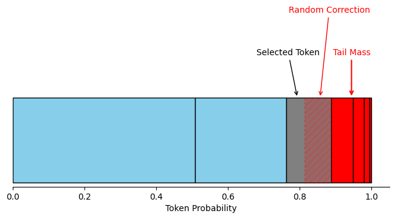
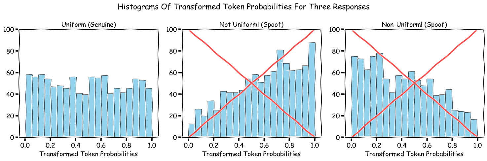

# Experiments In Inference Verification

## Introduction

Inference.net is a decentralized network of GPU operators who use spare compute cycles to generate inference responses for customers. A large and diverse supplier pool provides high availability and performance for various models.

Delegating compute to diverse suppliers creates a trust relationship between Inference.net and its operators.

Significant investment has been made in *detecting* when operators may be abusing this trust by not using the requested model to perform inference.

While efforts in these areas are ongoing, the results of initial experiments are presented here.

## Why Verification Is Challenging

The following example illustrates the challenge of distinguishing between responses generated by different models.

**Example Prompt:** `Describe the origins of baseball in a few brief sentences`.

**Response A:**

`The origins of baseball are often attributed to the mid-19th century in the northeastern United States, specifically in New York City, where various forms of bat-and-ball games were played by different cultures, including the English, Irish, and African Americans. The modern game of baseball as we know it today is often credited to Abner Doubleday, who supposedly invented the game in 1839 in Cooperstown, New York, although this claim is disputed among historians.`

**Response B:**

`The origins of baseball are debated, but it evolved from older bat-and-ball games like *rounders* (England) and *town ball* (America). The modern version was formalized in the mid-19th century, with Alexander Cartwright and the Knickerbocker Base Ball Club (1845) establishing key rules, such as the diamond-shaped infield and three-strike rule. The first recorded game under these rules was played in 1846 in Hoboken, New Jersey. Baseball grew into "America's pastime" by the late 1800s.`

These responses were generated by `Deepseek-v3` and `llama-3.1-8b-instruct`, respectively, which have significantly different hardware costs.  Just by inspecting the text, there is no clear indication that the responses were generated by different models.

## Non-Determinism In Inference

LLMs exhibit *deep non-determinism*. Identical inputs (prompt, hyper-parameters, model, and device) produce varied outputs across different runs.

This non-determinism prevents simple verification methods such as prompt re-execution and result comparison due to:
1. Non-associativity of floating-point operations: `(a + b) + c != a + (b + c)`
2. Lack of strict evaluation order in CUDA/GEMM for commutative operations

While deterministic modes exist for some operations, many critical functions (e.g., cumulative sum) lack this capability.

## Related Work

Verifiable LLM inference as field is still maturing.  While there are several efforts in the ZK-proof direction, the current best proof generation times as of writing are still prohibitively high for real-time verification. See [ZKP survey paper](https://arxiv.org/pdf/2310.14848) for a survey of existing ZKP techniques for Machine Learning.

Another research direction is to use purpose-trained models to distinguish between genuine and spoofed responses.  [SVIP](https://arxiv.org/pdf/2410.22307) is an example of such an approach.  However, techniques that involve the training of a custom model are not suited towards Inference.net because these models are generally not available, and the models used by Inference.net are rapidly changing.

[Watermarking approaches](https://arxiv.org/pdf/2312.04469) are another direction, but they are also not well-suited for Inference.net because they require custom fine-tuning or modification of model architecture or weights - again, not viable for Inference.net.

## Experimental Methods and Results

### The Response Plausibility Test

The Response Plausibility Test is a statistical test designed to determine if it is plausible that a model response was generated by the specified model and the specified prompt.  To the best of our knowledge, this is a novel application of the Probability Integral Transform ([PIT](https://en.wikipedia.org/wiki/Probability_integral_transform)) to assessing LLM inference response plausibility.

However, the [results](#results) were somewhat disappointing, and we are currently working on a more effective method.

First, the Response Plausibility Test pre-fills the model with both prompt and response in a single forward pass to collect the full token probability distribution for each token position.

Then, we discard the Token Probability Distributions associated with the prompt tokens, leaving only the response tokens.

Each response token is evaluated against its probability distribution to assess sequence plausibility. An abundance of unlikely tokens is an indication that the response was not generated by the specified model.

A significant consideration is that token likelihood varies with temperature and model certainty. Broader probability distributions (resulting from either factor) typically yield tokens with lower individual probabilities compared to more concentrated distributions.

### Details

The Response Plausibility Test is very compact, containing only 10 lines of Python code.

```python
    T = M_p.shape[0]
    VOCAB_DIM = M_p.shape[1]
    P_obs = M_p[np.arange(T), token_ids]
    tail_mask = M_p < P_obs.reshape([-1, 1])
    tail_mass = np.multiply(tail_mask, M_p).sum(axis=1)
    U = tail_mass + P_obs * np.random.rand(len(P_obs))
    np.clip(U, 1e-323, 1.0, out=U)
    F = -2.0 * np.log(U).sum()
    raw_p_value = chi2.sf(F, df=2 * T)
    p_value = 2 * min(raw_p_value, 1 - raw_p_value)
```

### How It Works


1. `M_p` is a matrix of token probabilities, where each row is a position in the token sequence, and each column is a vocabulary token.  Therefore, `M_p` contains the full token probability distribution at every step, and `M_p[i,j]` contains the probability of selecting token `j` at position `i`.

2. `token_ids` is the list of token IDs of the model's response.

3. `P_obs` is the list of observed token probabilities, accessed by indexing into `M_p` with the `token_ids`.

4. `tail_mass` is the sum of all probabilities less than or equal to the observed token probability `P_obs`, computed by element-wise multiplication of `tail_mask` and `M_p`, and then summing the result.

5. `U` is the `tail_mass` with a statistical correction applied, computed by adding a random fraction of the selected token's probability from the tail mass.

6. `F` is the sum of the negative log of `U`, computed by summing the negative log of `U`.

7. `raw_p_value` is the survival function of the chi-squared distribution with `2 * T` degrees of freedom, computed by `chi2.sf(F, df=2 * T)`.

8. `p_value` is the minimum of `raw_p_value` and `1 - raw_p_value`, computed by `min(raw_p_value, 1 - raw_p_value)`.

### Why It Works

There are a number of statistical tests available to determine if a sample from a continuous distribution is consistent with a single, fixed reference distribution, such as the [Kolmogorov-Smirnov test](https://en.wikipedia.org/wiki/Kolmogorov%E2%80%93Smirnov_test), or [Fisher's Method](https://en.wikipedia.org/wiki/Fisher%27s_method), or [Stouffer's Z-test](https://en.wikipedia.org/wiki/Fisher%27s_method#Relation_to_Stouffer's_Z-score_method).  

If we are able to transform our token probability distributions into a sequence of values that are presumably all drawn from a single, standard reference distribution, we could apply one of these tests.

Here's the key: It turns out that any continuous distribution can be transformed into a standard uniform distribution by applying a cumulative distribution function (CDF) to each observation in the sample.  If we can somehow transform our *discrete* token probability distributions into a sequence of values that are presumably all drawn from the standard uniform distribution, we could apply one of these tests.

To apply the PIT, we'll replace the token probability with the sum of all probabilities *less than* the probability of the selected token.  This is the `tail mass`, which is a way of computing the CDF for a discrete distribution.



Next, we'll add a random fraction of the selected token's probability to the tail mass.  Thus, our transformed token probability is the sum of both the tail mass and the hatched red area, which is a random correction.  


As shown in [Hamerle and Plank (2009)](https://www.risk-research.de/fileadmin/userdaten/docs/Fachartikel/2009_HamerlePlank_ANoteOnTheBerkowitzTest__7_.pdf), applying this transformation to a sampling process from the token probability distribution would yield a uniform distribution.



By applying this transformation to every token in the sequence, we can treat the transformed values from the entire response sequence as a single, large sample from a standard uniform distribution.

Now that we have a sequence of values which are presumably all drawn from a standard uniform distribution, we can apply a statistical test to determine if this transformed series of values is consistent with sampling from a standard uniform distribution.



In our case, we used Fisher's Method to compute a p-value for each sequence with a significance level of 0.01.

### Dataset

We collected 250 unique prompts from the Ultrachat dataset (Temperature=1.0), and generated responses with an NVIDIA 3090 GPU for each prompt using the following models:
- `3.1-8b-instruct`
- `3.2-3b-instruct`
- `neuralmagic-3.1-8b-instruct` (FP8 quantization of `3.1-8b-instruct`)


Using this raw data, we constructed the following datasets:

- **Model Substitution:** `3.2-3b-instruct` responses evaluated by `3.1-8b-instruct`
- **Quantization Substitution:** `neuralmagic-3.1-8b-instruct-fp8` responses evaluated by `3.1-8b-instruct`

### Method

We computed p-values for each dataset using our plausibility test under the assumption that the responses were generated by the specified model.  We truncated token sequences to 500 tokens to fit the memory constraints of the GPU when collecting token probability distributions.

### Results

#### Model Substitution

| Metric | Value |
|--------|-------|
| AUC | 0.79 |
| Type I Error Rate (at α=1e-2) | 9.6% |
| Power (at α=1e-2) | 45.9% |

#### Quantization Substitution

| Metric | Value |
|--------|-------|
| AUC | 0.52 |
| Type I Error Rate (at α=1e-2) | 9.6% |
| Power (at α=1e-2) | 12.8% |

#### Conclusions

The results indicate that the method:
* Is ineffective at distinguishing between quantized versions of the same model (AUC: 0.52)
* Has moderate effectiveness distinguishing between different models (AUC: 0.79)

Although it is not a standard practice, a verification classifier can be constructed by using the p-value as a classifier threshold.

With a conservative p-value threshold of 1e-4:

| Metric | Value |
|--------|-------|
| Type I Error Rate | 2.0% |
| Power | 20% |

This yields a detection rate of approximately 20% for spoofed responses, with a false positive rate of 4%. The limitations of this approach are acknowledged, and research continues to improve the test power.

### Baseline

Previous experiments included:
1. Re-running prompts using `3.1-8b-instruct` to create a replicated response
2. Embedding both the original and replicated responses using `gemini-exp-03-7` and several other embedding models
3. Using cosine similarity to compute an AUC score, measuring the effectiveness of similarity as a verification method

## Baseline Comparison

### Cosine Similarity Based Verification

As a baseline for comparison, we developed a basic cosine similarity-based verification method.

### Dataset

We collected 250 Ultrachat prompts, and generated responses with an NVIDIA 3090 GPU using the following models:
- `3.1-8b-instruct`
- `3.2-3b-instruct`
- `neuralmagic-3.1-8b-instruct` (FP8 quantization of `3.1-8b-instruct`)

Then, for each collected response, we ran the prompt a *second* time with `3.1-8b-instruct` to create a replicated response.

### Method

Next, we embedded both the original response and the replicated response using `distiluse-base-multilingual-cased-v1` (we also evaluated several other embedding models - this one was the best performer, although `gemini-embedding-exp-03-07` was also a strong performer).

Finally, we computed a cosine similarity score between the embedding of the original response and the embedding of the replicated response.

### Results

#### Model Substitution

| Metric | Value |
|--------|-------|
| AUC | 0.51 |
| Type I Error Rate | 51.2% |
| Power (at α=1e-2) | 44.4% |

#### Quantization Substitution

| Metric | Value |
|--------|-------|
| AUC | 0.48 |
| Type I Error Rate | 47.6% |
| Power (at α=1e-2) | 48.3% |


### Conclusions

We found that cosine embedding (even with the best performing model) was little better than chance for both distinguishing between `3.1-8b-instruct` and `3.2-3b-instruct` and, somewhat worse than chance for detecting different quantizations of `3.1-8b-instruct`.

Overall, the results indicate that cosine embedding is not a reliable verification method.